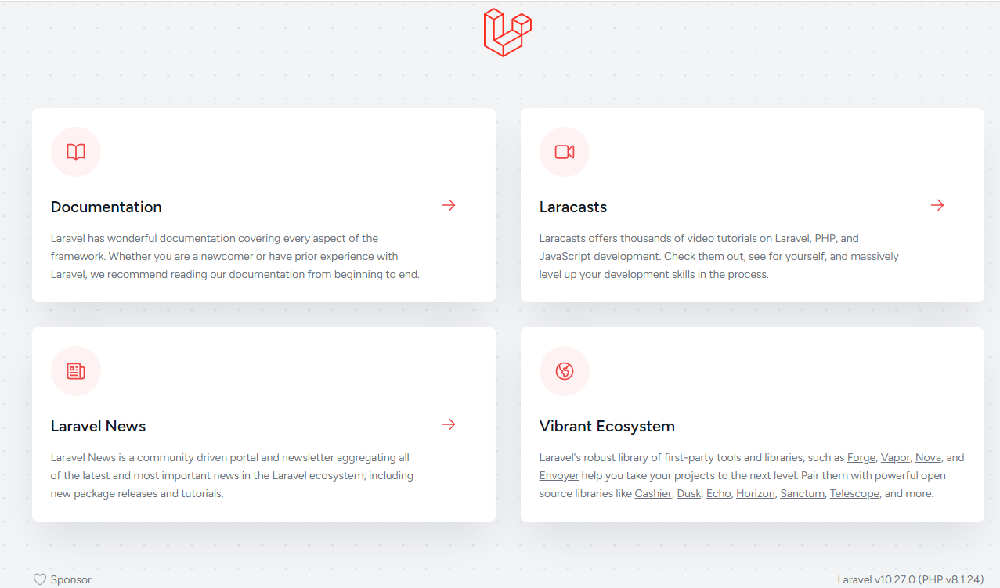

# 第十章：终止程序

现在，我们来到框架执行过程中的最后一个阶段（第六阶段），这个阶段对应下面这一行语句：

```php
$kernel->terminate($request, $response);
```

> public/index.php

显然terminate方法是属于类\Illuminate\Foundation\Http\Kernel的：

```php
/**
 * Call the terminate method on any terminable middleware.
 *
 * @param  \Illuminate\Http\Request  $request
 * @param  \Illuminate\Http\Response  $response
 * @return void
 */
public function terminate($request, $response)
{
	$this->terminateMiddleware($request, $response);

	$this->app->terminate();
	
	foreach ($this->requestLifecycleDurationHandlers as ['threshold' => $threshold, 'handler' => $handler]) {
        $end ??= Carbon::now();

        if ($this->requestStartedAt->diffInMilliseconds($end) > $threshold) {
            $handler($this->requestStartedAt, $request, $response);
        }
    }

    $this->requestStartedAt = null;
}
```

> vendor/laravel/framework/src/Illuminate/Foundation/Http/Kernel.php

继续追踪terminateMiddleware方法：

```php
 /**
   * Call the terminate method on any terminable middleware.
   *
   * @param  \Illuminate\Http\Request  $request
   * @param  \Illuminate\Http\Response  $response
   * @return void
   */
protected function terminateMiddleware($request, $response)
{
	$middlewares = $this->app->shouldSkipMiddleware() ? [] : array_merge(
		$this->gatherRouteMiddleware($request),
		$this->middleware
	);

	foreach ($middlewares as $middleware) {
		if (! is_string($middleware)) {
			continue;
		}

		[$name] = $this->parseMiddleware($middleware);

		$instance = $this->app->make($name);

		if (method_exists($instance, 'terminate')) {
			$instance->terminate($request, $response);
		}
	}
}
```

> vendor/laravel/framework/src/Illuminate/Foundation/Http/Kernel.php

这个方法体，是在处理所有中间件中的terminate方法，框架定义了规则：中间件中定义的terminate方法，会在这个阶段执行。

接下来继续看最后这行语句：

```php
$this->app->terminate();
```

> vendor/laravel/framework/src/Illuminate/Foundation/Http/Kernel.php

我们知道$this->app是指向应用唯一的容器实例，对应的类文件是：\Illuminate\Foundation\Application.php，因此很容易就能找到terminate方法：

```php
/**
 * Terminate the application.
 *
 * @return void
 */
 public function terminate()
{
    $index = 0;

    while ($index < count($this->terminatingCallbacks)) {
        $this->call($this->terminatingCallbacks[$index]);

        $index++;
    }
}
```

> vendor/laravel/framework/src/Illuminate/Foundation/Application.php

这里是执行app容器身上绑定的terminatingCallback事件，而terminatingCallbacks中的内容是通过调用Application类中的terminating方法进行"装填"的。那什么时候框架会调用terminating方法呢，通过在phpstorm IDE中对">terminating("字符串进行全局查找，我们并没有发现哪里有主动执行这个方法，我们猜测这里是需要用户自己去主动调用的。

由于我们访问的默认主页这个URL对应的controller和相关的其他所有代码中都没有包含这部分处理，因此即使在terminate方法中主动加exit，也不会影响程序的执行：

```php
public function terminate()
{
    exit('ccc');
	$index = 0;

    while ($index < count($this->terminatingCallbacks)) {
        $this->call($this->terminatingCallbacks[$index]);

        $index++;
    }
}
```

> vendor/laravel/framework/src/Illuminate/Foundation/Application.php

程序并不会输出ccc，而是正常显示首页：



最后一段代码：
```php
foreach ($this->requestLifecycleDurationHandlers as ['threshold' => $threshold, 'handler' => $handler]) {
    $end ??= Carbon::now();

    if ($this->requestStartedAt->diffInMilliseconds($end) > $threshold) {
        $handler($this->requestStartedAt, $request, $response);
    }
}

$this->requestStartedAt = null;
```
这里是Laravel9新增的部分，用于处理请求时间过长的情况。我们全局搜索requestLifecycleDurationHandlers关键字，可以发现只有下面这个方法
有对其进行赋值的操作：
```
/**
 * Register a callback to be invoked when the requests lifecycle duration exceeds a given amount of time.
 *
 * @param  \DateTimeInterface|\Carbon\CarbonInterval|float|int  $threshold
 * @param  callable  $handler
 * @return void
 */
public function whenRequestLifecycleIsLongerThan($threshold, $handler)
{
    $threshold = $threshold instanceof DateTimeInterface
        ? $this->secondsUntil($threshold) * 1000
        : $threshold;

    $threshold = $threshold instanceof CarbonInterval
        ? $threshold->totalMilliseconds
        : $threshold;

    $this->requestLifecycleDurationHandlers[] = [
        'threshold' => $threshold,
        'handler' => $handler,
    ];
}
```
继续全局搜索whenRequestLifecycleIsLongerThan，除了方法定义的地方外，没有发现有别的代码包含这个方法的调用。因此，这个方法需要
开发者主动调用。